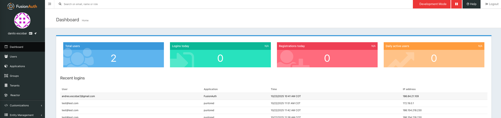
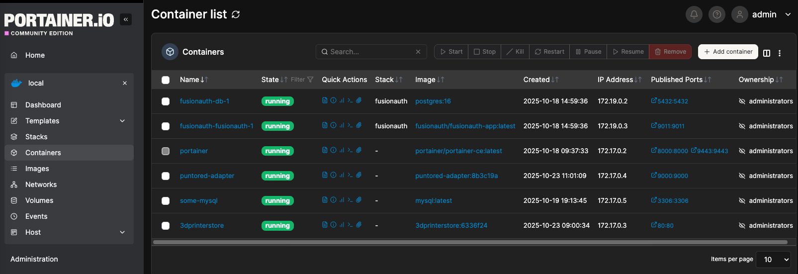
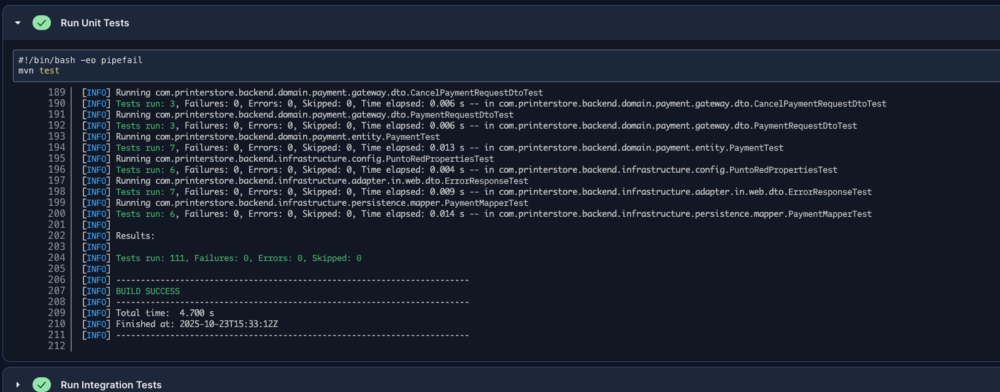
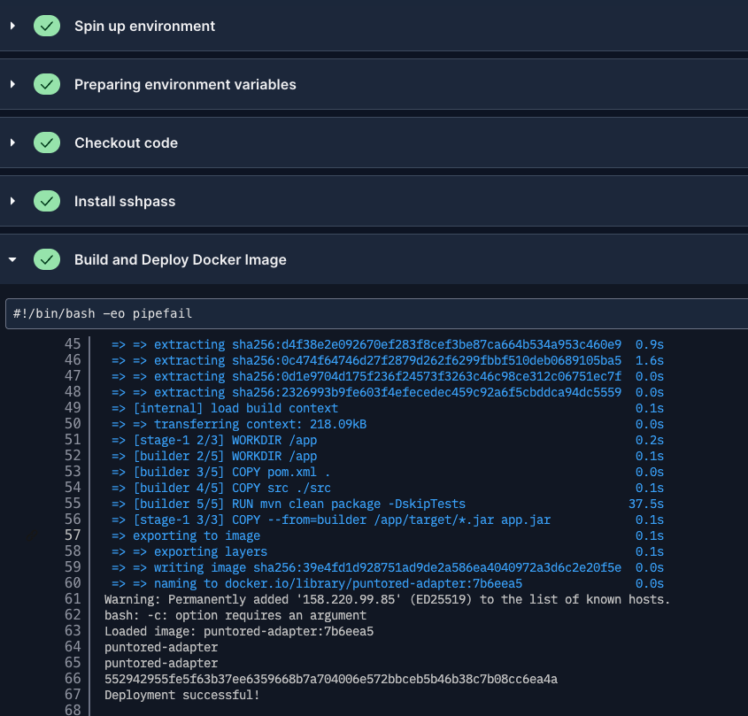

# 🖨️ Backend de Tienda de Impresoras 3D

Servicio backend para la aplicación de Tienda de Impresoras 3D - una solución integral para gestionar equipos de impresión 3D y servicios relacionados.

## 📋 Descripción General

### 🎯 Contexto: Prueba Técnica para Punto Red

**Backend de Tienda de Impresoras 3D** es una aplicación Spring Boot desarrollada como **solución de prueba técnica para el proceso de selección en Punto Red**. Este proyecto demuestra las capacidades en diseño arquitectónico y  desarrollo backend.

**Características Principales del Proyecto:**
- Implementación de **Arquitectura Hexagonal** (Puertos y Adaptadores) para máxima flexibilidad y testabilidad
- API RESTful segura con autenticación JWT integrada
- Pipeline CI/CD completamente automatizado con CircleCI
- Integración con la API de Punto Red para gestión de precios y productos
- Despliegue en producción con Docker y orquestación automática
- Suite completa de pruebas unitarias e integración

Este servicio actúa como la capa de lógica empresarial central para el [Frontend de Tienda de Impresoras 3D](https://github.com/yourusername/3dprinterstorefront), manejando todas las operaciones backend, gestión de datos e integraciones con servicios externos.

### Estado
🚀 **Despliegue en Producción**: http://158.220.99.85/  
🤖 **Despliegues Automáticos**: Habilitados con CircleCI  
✅ **Estado**: Producción y Estable

#### Sistema de CI/CD Automático
El proyecto cuenta con un pipeline de **integración continua y despliegue continuo (CI/CD)** completamente automatizado:

- **Trigger**: Se activa automáticamente con cada push a las ramas `main`, `master` o `develop`
- **Compilación**: Automatizada en cada commit
- **🧪 Pruebas Unitarias**: Ejecutadas con JUnit 5 en cada commit
- **Construcción Docker**: Imagen generada automáticamente (solo si pruebas pasan ✅)
- **Despliegue Automático**: Deployment a producción en `http://158.220.99.85` (solo si todo está bien)
- **Archivo de Configuración**: `.circleci/config.yml`
- **Garantía de Calidad**: ❌ Si alguna prueba falla, el pipeline se detiene y no se despliega

---

## 🏗️ Arquitectura

Este proyecto implementa **Arquitectura Hexagonal** (Puertos y Adaptadores), asegurando una separación clara de responsabilidades e independencia de frameworks externos.

### 🔄 Diagrama de Arquitectura a Alto Nivel

La solución completa está compuesta por múltiples capas que se comunican de manera segura y eficiente:

```
╔═══════════════════════════════════════════════════════════════════════════════╗
║                      🖥️  CAPA DE PRESENTACIÓN                                 ║
║                   Frontend (React/Angular/Vue)                                ║
║              https://github.com/daniloescobar15/3dPrinterStoreFront           ║
╚════════════════════════════════════╤══════════════════════════════════════════╝
                                     │
                        ┌─────────────────────────────┐
                        │  HTTP/REST (API RESTful)    │
                        │  Autenticado con JWT        │
                        └─────────────────────────────┘
                                     │
                                     ▼
╔══════════════════════════════════════════════════════════════════════════════╗
║                       🚀 BACKEND - SPRING BOOT                               ║
║                   🐳 Docker: 3dprinterstorebackend:latest                    ║
║                   Puerto: 9000 | Contexto: /api                              ║
╠══════════════════════════════════════════════════════════════════════════════╣
║ ┌─────────────────────────────────────────────────────────────────────────┐  ║
║ │         🔄 REST CONTROLLERS & ENDPOINTS                                 │  ║
║ │   GET/POST/PUT/DELETE → /api/productos, /api/usuarios, /api/pedidos     │  ║
║ └──────────────────────────────┬──────────────────────────────────────────┘  ║
║                                │                                             ║
║ ┌──────────────────────────────▼──────────────────────────────────────────┐  ║
║ │ 🛡️  CAPA DE SEGURIDAD - JWT/OAuth2 Validation & Authorization          │   ║
║ │    (Valida tokens contra FusionAuth JWKS)                              │   ║
║ └──────────────────────────────┬──────────────────────────────────────────┘  ║
║                                │                                             ║
║ ┌──────────────────────────────▼──────────────────────────────────────────┐  ║
║ │ ⚙️  CAPA DE APLICACIÓN                                                  │  ║
║ │    (Orquestación de Casos de Uso)                                       │  ║
║ └──────────────────────────────┬──────────────────────────────────────────┘  ║
║                                │                                             ║
║ ┌──────────────────────────────▼──────────────────────────────────────────┐  ║
║ │ 🎯 CAPA DE DOMINIO                                                      │  ║
║ │    (Reglas de Negocio & Lógica Empresarial - Independiente de Frameworks)  ║
║ └──────────────────────────────┬──────────────────────────────────────────┘  ║
║                                │                                             ║
║ ┌──────────────────────────────▼──────────────────────────────────────────┐  ║
║ │ 🔌 ADAPTADORES / PUERTOS                                                │  ║
║ │    (Implementaciones de Interfaces)                                     │  ║
║ └──────────────────────────────┬──────────────────────────────────────────┘  ║
║                                │                                             ║
╚════════════════════════════════╤═════════════════════════════════════════════╝
                                 │
                ┌────────────────┼────────────────┐
                │                │                │
                ▼                ▼                ▼
        ╔═══════════════╗  ╔═══════════════╗  ╔═══════════════╗
        ║  AUTENTICACIÓN║  ║ 💾 BASE DATOS ║  ║ 📡API EXTERNA ║
        ╠═══════════════╣  ╠═══════════════╣  ╠═══════════════╣
        ║ FusionAuth    ║  ║ MySQL 8.0+    ║  ║ Punto Red     ║
        ║ :9011         ║  ║ :3306         ║  ║ Sandbox v1    ║
        ║               ║  ║               ║  ║               ║
        ║ ✓ Usuarios    ║  ║ ✓ Productos   ║  ║ ✓ Precios     ║
        ║ ✓ JWT/OAuth2  ║  ║ ✓ Usuarios    ║  ║ ✓ Catálogo    ║
        ║ ✓ JWKS        ║  ║ ✓ Pedidos     ║  ║ ✓ Integración ║
        ║ ✓ MFA/RBAC    ║  ║ ✓ BD: punto_  ║  ║ B2B           ║
        ║               ║  ║   red         ║  ║               ║
        ╚═══════════════╝  ╚═════════════ ═╝  ╚═══════════════╝
```

#### 📊 Flujo de Datos de la Solución

1. **Frontend → Backend**: El frontend envía peticiones HTTP REST autenticadas con JWT
2. **Validación**: El backend valida el JWT contra FusionAuth (JWKS)
3. **Procesamiento**: La lógica de negocio procesa la solicitud en capas
4. **Persistencia**: Los datos se guardan/recuperan de MySQL
5. **Integraciones**: El backend obtiene datos de terceros (API Punto Red) cuando es necesario
6. **Respuesta**: El backend devuelve datos al frontend

#### 🔌 Puertos y Adaptadores - Conexiones Externas

| Componente | Dirección | Protocolo | Propósito |
|-----------|-----------|-----------|----------|
| **Frontend** | → Backend | HTTP/REST | Peticiones de usuario |
| **Backend** | ← Frontend | HTTP/REST | Respuestas de API |
| **Backend** | ↔ FusionAuth | HTTPS | Validación de tokens JWT |
| **Backend** | ↔ MySQL | JDBC | Persistencia de datos |
| **Backend** | → API Punto Red | HTTPS | Datos de productos/precios |
| **Docker** | - | - | Despliegue y orquestación |

### Capas de la Arquitectura

```
┌─────────────────────────────────────────────────────┐
│       INTERFACES EXTERNAS (HTTP, Eventos)           │
├─────────────────────────────────────────────────────┤
│                    ADAPTADORES                      │
│  ┌──────────────┐  ┌──────────────┐  ┌──────────┐   │
│  │  Controlador │  │   Base de    │  │ Servicios│   │
│  │    Web       │  │    Datos     │  │ Externos │   │
│  └──────────────┘  └──────────────┘  └──────────┘   │
├─────────────────────────────────────────────────────┤
│              CAPA DE APLICACIÓN                     │
│      (Casos de Uso & Orquestación de Lógica)        │
├─────────────────────────────────────────────────────┤
│                CAPA DE DOMINIO                      │
│    (Reglas de Negocio Centrales & Entidades)        │
├─────────────────────────────────────────────────────┤
│         PUERTOS (Interfaces/Contratos)              │
├─────────────────────────────────────────────────────┤
│            CAPA DE INFRAESTRUCTURA                  │
│   (JPA, MySQL, Clientes HTTP, Autenticación)        │
└─────────────────────────────────────────────────────┘
```
### Architecture ideal (punto de mejora)


Para desacoplar los componentes de arquitectura y desacoplar la logica de pagos usando el patron adapter para poder tener mas proveedores de pagos, se recomienda implementar un patrón de microservicios, por lo que los componentes que deberian estar en la arquitectura son los siguientes:
- **Frontend**: Angular 
- **Gateway**: Spring Boot, donde se hacen las validaciones de seguridad y se integran los diferentes sistemas
- **FutionAuth server**: FutionAuth, servicio para la autenticacion y autorizacion de usuarios
- **Payments-engine**: Spring Boot, para desacoplar la logica de pagos
- **Base de Datos de pagos**: MySQL: Se usuario unicamente para la logica de pagos
- **Product-engine**: Spring Boot, para desacoplar la logica de pagos
- **Base de Datos de productos**: MySQL: Se usuario unicamente para la logica de productos
- **API de Punto Red** api de integracion con punto red
- **Adaptador de punto red** para integrar la logica de pago con punto red
- **Redis** para el manejo del cache de tokens de punto-red


### Estructura del Proyecto

```
src/main/java/com/printerstore/backend/
├── domain/                          # 🎯 Lógica empresarial central (entidades, valores)
├── application/                     # ⚙️ Casos de uso y capa de orquestación
├── infrastructure/                  # 🔌 Adaptadores (repositorios, clientes HTTP, etc.)
├── configuration/                   # ⚙️ Configuración de Spring y beans
└── Application.java                 # 🚀 Punto de entrada

src/main/resources/
└── application.yaml                 # Propiedades de configuración
```

---

## 🔗 Integración de Sistemas

### Conexión con el Frontend
- **Repositorio**: [Frontend de Tienda de Impresoras 3D](https://github.com/daniloescobar15/3dPrinterStoreFront)
- **Endpoint de API**: `http://158.220.99.85/api`
- **Ruta de Contexto**: `/api`
- **Puerto del Servidor**: `9000`

### Servicio de Autenticación (FusionAuth)

**URL del Servicio**: `http://158.220.99.85:9011`

#### 🔐 Ventajas de FusionAuth como Solución de Autenticación

FusionAuth ha sido seleccionado como servicio de autenticación por ofrecer una solución profesional, robusta y altamente configurable:

**✅ Administración Centralizada de Usuarios:**
- Panel de administración intuitivo para gestionar usuarios, roles y permisos
- Autenticación multi-factor (MFA) disponible
- Gestión de sesiones de usuario con políticas configurables
- Auditoría y trazabilidad completa de acciones de usuarios

**🔑 Métodos de Obtención de Tokens:**
- **OAuth 2.0**: Protocolo estándar de industria para autorización delegada
- **Flujo de autorización seguro** con code exchange
- Generación automática de tokens JWT con validez configurable
- Soporte para múltiples aplicaciones dentro de la misma instancia
- Tokens con información de usuario, roles y permisos embebida

**✔️ Verificación Segura de Tokens:**
- **Endpoint JWKS** (`http://158.220.99.85:9011/.well-known/jwks.json`): Público y seguro para obtener claves criptográficas
- Validación de tokens mediante firma digital (RSA/ECDSA)
- Verificación de expiración y emisor del token
- Soporte para validación sincrónica sin llamadas externas (después de cachear claves)
- Cumplimiento con estándares OpenID Connect (OIDC)

**🛡️ Seguridad y Confiabilidad:**
- Encriptación end-to-end de credenciales
- Cumplimiento con estándares de seguridad OWASP
- Protección contra ataques comunes (CSRF, XSS, etc.)
- Renovación de tokens con refresh tokens seguros
- Segregación completa de autenticación del backend de negocio

### Base de Datos
- **Tipo**: MySQL 8.0+
- **Host**: `158.220.99.85`
- **Puerto**: `3306`
- **Base de Datos**: `punto_red`
- **Driver**: MySQL Connector/J (v8.3.0)
- **Dialecto JPA**: MySQL Dialect con Hibernate
- **Estrategia DDL**: `update` (actualizaciones automáticas de esquema)

### Integraciones Externas
- **API de Punto Red**: Integración con portal Punto Red para datos de precios y productos
  - URL Base: `https://sandbox-v1.portalventas.net`
  - Endpoint de Precios: `/v1/pricing`
  - Autenticación: Basada en Usuario/Contraseña

---

## 🛠️ Stack Tecnológico

| Componente | Tecnología | Versión |
|-----------|-----------|---------|
| **Lenguaje** | Java | 21 |
| **Framework** | Spring Boot | 3.3.5 |
| **Herramienta de Compilación** | Maven | 3.x |
| **Base de Datos** | MySQL | 8.0+ |
| **ORM** | JPA/Hibernate | - |
| **Seguridad** | JWT (JWKS) | - |
| **Autenticación** | FusionAuth | - |
| **Cliente HTTP** | Spring WebClient | Integrado |
| **Utilidades** | Lombok | 1.18.30 |
| **Pruebas** | JUnit 5, AssertJ | Últimas |

### Dependencias Clave
- **Spring Boot Starter Web**: Desarrollo de APIs RESTful
- **Spring Boot Data JPA**: Capa de abstracción de base de datos
- **MySQL Connector/J**: Driver de base de datos
- **Nimbus JOSE JWT**: Validación de JWT
- **Auth0 JWT**: Utilidades de manejo de JWT
- **Lombok**: Reducción de código boilerplate

---

## 🚀 Primeros Pasos

### Requisitos Previos
- **Java 21+** instalado
- **Maven 3.6+** instalado
- **MySQL 8.0+** ejecutándose y accesible
- **FusionAuth** ejecutándose en `http://158.220.99.85:9011`

### Instalación y Configuración

1. **Clonar el repositorio**
   ```bash
   git clone https://github.com/yourusername/3dprinterstorebackend.git
   cd 3dprinterstorebackend
   ```

2. **Configurar variables de entorno** (o actualizar `application.yaml`)
   ```yaml
   # Configuración de Base de Datos
   spring.datasource.url=jdbc:mysql://158.220.99.85:3306/punto_red
   spring.datasource.username=puntored_user
   spring.datasource.password=TU_CONTRASEÑA_BD
   
   # Configuración de FusionAuth
   fusion-auth.jwks-url=http://158.220.99.85:9011/.well-known/jwks.json
   
   # Configuración de API de Punto Red
   punto-red.webclient.url=https://sandbox-v1.portalventas.net
   ```

3. **Compilar el proyecto**
   ```bash
   mvn clean package
   ```

4. **Ejecutar la aplicación**
   ```bash
   mvn spring-boot:run
   ```
   o
   ```bash
   java -jar target/3dprinterstorebackend-1.0.0.jar
   ```

5. **Verificar que el servicio está ejecutándose**
   ```bash
   curl http://localhost:9000/api/health
   ```

---

## 📡 Documentación de API

El backend proporciona endpoints de API REST servidos en la ruta de contexto `/api`.

### URL Base
- **Desarrollo Local**: `http://localhost:9000/api`
- **Producción**: `http://158.220.99.85/api`

### 📮 Collection de Postman

Para facilitar las pruebas de los endpoints, se proporciona una **collection completa de Postman** con todos los endpoints implementados:

📁 **Archivo**: `punto_red.postman_collection.json`

**Cómo importar en Postman:**
1. Abre Postman
2. Click en `Import` → Selecciona `punto_red.postman_collection.json`
3. Todos los endpoints con variables de entorno estarán disponibles
4. Reemplaza las variables de entorno con tus valores (tokens, URLs, etc.)

### Características Clave
- ✅ Autenticación basada en JWT vía FusionAuth
- ✅ Diseño de API RESTful
- ✅ Manejo integral de errores
- ✅ Validación de solicitudes/respuestas
- ✅ Persistencia de datos con JPA

---

## 🔐 Seguridad

### Flujo de Autenticación
1. El frontend se autentica con **FusionAuth** en `http://158.220.99.85:9011`
2. FusionAuth emite un token **JWT**
3. El frontend incluye el token en el encabezado `Authorization` al llamar a las APIs del backend
4. El backend valida el token usando el **endpoint JWKS**
5. La solicitud se procesa si el token es válido

### Configuración
- **ID de Aplicación**: `5359f6f6-42ef-43a5-a840-29d0e8b961fa`
- **URL JWKS**: `http://158.220.99.85:9011/.well-known/jwks.json`
- **Validación de Tokens**: Automática mediante bibliotecas JWT (Nimbus, Auth0)

---

## 📦 Despliegue en Docker

El proyecto incluye soporte Docker para despliegue en contenedores. en el servidor vps 158.220.99.85

### Compilar Imagen Docker
```bash
mvn spring-boot:build-image
```

Esto crea una imagen llamada `puntored-adapter:1.0.0`

### Ejecutar Contenedor
```bash
docker run -d \
  -p 9000:9000 \
  -e SPRING_DATASOURCE_URL=jdbc:mysql://mysql-host:3306/punto_red \
  -e SPRING_DATASOURCE_USERNAME=puntored_user \
  -e SPRING_DATASOURCE_PASSWORD=contraseña \
  3dprinterstorebackend:1.0.0
```

Consulta `.dockerignore` para los archivos excluidos durante las compilaciones de Docker.


---

## 🧪 Pruebas

### Ejecución Automática en el Pipeline
✅ Todas las pruebas unitarias e integración se ejecutan **automáticamente en CircleCI** con cada commit a las ramas `main`, `master` o `develop`.  
❌ Si alguna prueba falla, el pipeline se detiene y **no se despliega a producción**.

### Ejecutar Pruebas Localmente
```bash
# Pruebas unitarias
mvn test

# Pruebas de integración
mvn verify

# Todas las pruebas
mvn clean package
```

### Configuración de Pruebas
- **Framework**: JUnit 5
- **Aserciones**: AssertJ
- **Clases de Prueba**: 
  - Unitarias: `*Test.java`, `*Tests.java`
  - Integración: `*IT.java`
- **Plugin Surefire**: Ejecuta pruebas durante la compilación de Maven
- **Reportes**: `target/surefire-reports/` (generados en cada ejecución)
- **En CI/CD**: Los reportes se almacenan en CircleCI para consulta posterior

---

## 🚀 Despliegue en Producción

### Despliegue Actual
- **Servidor**: `http://158.220.99.85`
- **Estado**: ✅ Producción y Estable
- **Puerto**: `9000`

---

## 🔄 Pipeline de CI/CD con CircleCI

### Configuración del Pipeline
- **Archivo de Configuración**: `.circleci/config.yml`
- **Plataforma**: CircleCI (versión 2.1)
- **Entorno de Ejecución**: Ubuntu 2404:2024.05.1

### Workflow de Despliegue: `build-and-deploy`

El pipeline se ejecuta automáticamente en cada push a las siguientes ramas:
- `main` (rama de producción)
- `master` (rama alternativa de producción)
- `develop` (rama de desarrollo)

#### Etapas del Pipeline

**1. 🏗️ Job: `build-and-test` (Compilación, Pruebas Unitarias e Integración)**
   
   Este job es crítico y ejecuta todas las validaciones antes de pasar a los siguientes pasos:
   
   - 📦 Instala Java 21 y Maven
   - 🔨 Compila el proyecto: `mvn clean package`
   - ✅ **Ejecuta Pruebas Unitarias**: `mvn test`
     - Busca todos los archivos `*Test.java`, `*Tests.java`
     - Utiliza JUnit 5 y AssertJ para validaciones
     - Detiene el pipeline si alguna prueba falla ❌
   - ✅ **Ejecuta Pruebas de Integración**: `mvn verify`
     - Ejecuta pruebas `*IT.java`
     - Valida la integración de componentes
     - Detiene el pipeline si las pruebas fallan ❌
   - 📊 Almacena reportes de pruebas en `target/surefire-reports`
   - 📦 Genera artifact JAR: `puntored-adapter-1.0.0.jar`
   - **Status**: ✅ Debe completarse exitosamente para continuar
   - **Fallos**: ❌ Si hay fallos en pruebas, el pipeline se detiene aquí y no continúa a los siguientes jobs

**2. 🐳 Job: `build-docker-image`**
   - Depende de: `build-and-test` ✓
   - Construye imagen Docker con tag: `puntored-adapter:${COMMIT_SHA}`
   - Crea también tag `latest` para versión más reciente
   - **Status**: Debe completarse para proceder al despliegue

**3. 🚀 Job: `deploy-to-production`**
   - Depende de: `build-docker-image` ✓
   - **Solo se ejecuta en ramas**: `main`, `master`, `develop`
   - Construye imagen Docker
   - Guarda imagen en archivo tar
   - Transfiere imagen al servidor `158.220.99.85` vía SSH
   - Detiene contenedor anterior (si existe)
   - Carga nueva imagen en el servidor
   - Inicia nuevo contenedor con:
     - Nombre: `puntored-adapter`
     - Puerto: `9000:9000`
     - Restart: `unless-stopped` (reinicio automático en caso de fallo)
   - Verifica despliegue exitoso

### Flujo de Despliegue Automático

```
Git Push (main/master/develop)
   ↓
🚀 CircleCI Trigger - Pipeline Iniciado
   ↓
┌────────────────────────────────────────────────┐
│ 1️⃣ build-and-test (CRÍTICO)                    │
├────────────────────────────────────────────────┤
│ 📦 Instalar Java 21 & Maven                    │
│ 🔨 Compilar (mvn clean package)                │
│ ✅ Pruebas Unitarias (mvn test)                │
│    └─ JUnit 5 + AssertJ                        │
│ ✅ Pruebas Integración (mvn verify)            │
│ 📊 Reportes: target/surefire-reports           │
└────────────────────────────────────────────────┘
   ↓ ✅ Si TODAS las pruebas PASAN
   ↓ ❌ Si hay FALLOS → DETENER PIPELINE
   ↓
┌────────────────────────────────────────────────┐
│ 2️⃣ build-docker-image                          │
├────────────────────────────────────────────────┤
│ 🐳 Construir imagen Docker                     │
│ 🏷️  Tag: puntored-adapter:${COMMIT_SHA}       │
│ 🏷️  Tag: puntored-adapter:latest              │
└────────────────────────────────────────────────┘
   ↓ ✅ Si imagen se crea exitosamente
   ↓
┌────────────────────────────────────────────────┐
│ 3️⃣ deploy-to-production                        │
│    (Solo si rama: main/master/develop)         │
├────────────────────────────────────────────────┤
│ 🚀 Build imagen Docker final                   │
│ 📤 Transferir a 158.220.99.85 vía SSH          │
│ 🛑 Detener contenedor anterior                 │
│ 📥 Cargar nueva imagen Docker                  │
│ ▶️  Iniciar contenedor puerto 9000             │
│ 🔄 Restart automático: unless-stopped         │
└────────────────────────────────────────────────┘
   ↓ ✅ Despliegue completado
   ↓
✅ Servicio disponible en: http://158.220.99.85/api
```

### 🧪 Pruebas Automáticas en el Pipeline

El pipeline ejecuta **pruebas exhaustivas** en cada commit para garantizar calidad:

#### Pruebas Unitarias
- **Comando**: `mvn test`
- **Framework**: JUnit 5
- **Aserciones**: AssertJ
- **Patrón de Archivos**: `*Test.java`, `*Tests.java`
- **Reportes**: Almacenados en `target/surefire-reports`
- **Comportamiento**: ❌ Si falla UNA prueba unitaria, todo el pipeline se detiene

#### Pruebas de Integración
- **Comando**: `mvn verify`
- **Patrón de Archivos**: `*IT.java`
- **Comportamiento**: ❌ Si falla UNA prueba de integración, todo el pipeline se detiene

#### Garantías del Pipeline
✅ No se genera imagen Docker si las pruebas fallan  
✅ No se despliega a producción si la compilación falla  
✅ Cada despliegue a `http://158.220.99.85/api` ha pasado todas las pruebas  

---

### Variables de Entorno Requeridas

Configuradas en CircleCI Project Settings:
- `SSH_PASS`: Contraseña SSH para acceder al servidor de producción

### Monitoreo del Pipeline

1. Accede a [CircleCI Dashboard](https://app.circleci.com)
2. Selecciona el proyecto `3dprinterstorebackend`
3. Observa el pipeline en tiempo real
4. Revisa logs de cada job si es necesario

### Pasos Manuales de Despliegue (Alternativa)

Si necesitas desplegar manualmente sin CI/CD:

```bash
# 1. Compilar
mvn clean package

# 2. Construir imagen Docker
docker build -t puntored-adapter:1.0.0 .

# 3. Transferir imagen
docker save puntored-adapter:1.0.0 -o puntored-adapter.tar
scp -P 22 puntored-adapter.tar root@158.220.99.85:/tmp/

# 4. Ejecutar en servidor remoto
ssh root@158.220.99.85
docker load -i /tmp/puntored-adapter.tar
docker stop puntored-adapter || true
docker run -d --name puntored-adapter -p 9000:9000 --restart unless-stopped puntored-adapter:1.0.0
```

---

### Screenshots del Pipeline CircleCI

> 📸 **Capturas de pantalla del pipeline en CircleCI**:
> 
> 
> 


---

##  Conexiones

### Principios de Arquitectura
- ✅ **Arquitectura Hexagonal**: Separación limpia entre lógica empresarial y preocupaciones externas
- ✅ **Diseño Dirigido por Dominio**: La lógica empresarial central es independiente del framework
- ✅ **Principios SOLID**: Responsabilidad Única, Abierto/Cerrado, Sustitución de Liskov, etc.
- ✅ **Inyección de Dependencias**: Bajo acoplamiento mediante contenedor IoC de Spring

### Conexiones de Servicios Externos
| Servicio | URL | Propósito |
|---------|-----|----------|
| FusionAuth | `http://158.220.99.85:9011` | Autenticación y Validación de Tokens |
| MySQL | `158.220.99.85:3306` | Persistencia de Datos |
| API de Punto Red | `https://sandbox-v1.portalventas.net` | Datos de Productos y Precios |
| Frontend | Dinámico | Interfaz de Usuario e Interacciones |

-